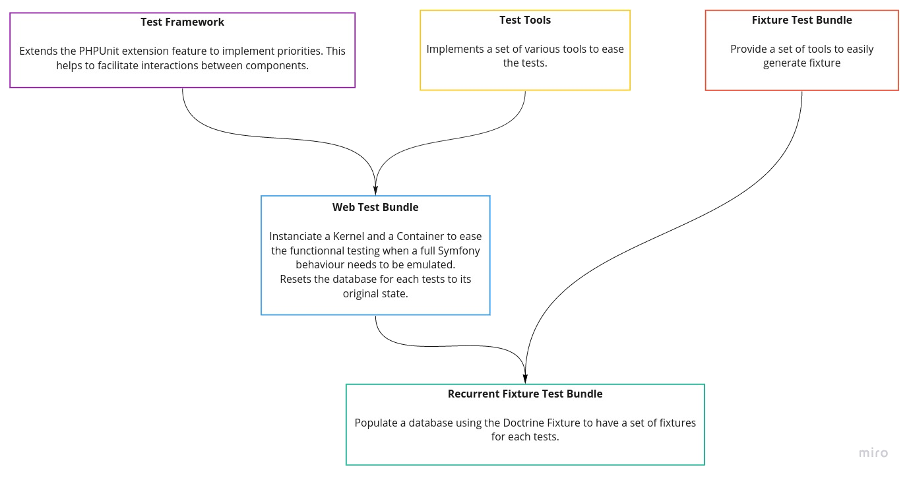

The Test Tools library
=======================================

[](https://packagist.org/packages/richcongress/test-suite)
[](https://github.com/richcongress/test-suite/issues)
[](LICENSE.md)


This bundle is a shortcut to install the whole RichCongress test suite for Symfony. It requires **PHP 7.3+** and **Symfony 4** or **Symfony 5**.

# Quick showcase

A great drawing is always better than a long speech.




# Table of content

1. [Installation](#1-installation)
2. [Versioning](#2-versioning)
3. [Contributing](#3-contributing)
4. [License](#4-license)


# 1. Installation

```bash
composer require richcongress/test-suite
```

Then, please check the documentation of the various libraries:
- [Test Framework](https://github.com/richcongress/test-framework/blob/master/README.md)
- [Test Tools](https://github.com/richcongress/test-tools/blob/master/README.md)
- [Web Test Bundle](https://github.com/richcongress/web-test-bundle/blob/master/README.md)
- [Fixture Test Bundle](https://github.com/richcongress/fixture-test-bundle/blob/master/README.md)
- [Reccurent Fixture Test Bundle](https://github.com/richcongress/recurrent-fixture-test-bundle/blob/master/README.md)


# 2. Versioning

test-suite follows [semantic versioning](https://semver.org/). In short the scheme is MAJOR.MINOR.PATCH where
1. MAJOR is bumped when there is a breaking change,
2. MINOR is bumped when a new feature is added in a backward-compatible way,
3. PATCH is bumped when a bug is fixed in a backward-compatible way.

Versions bellow 1.0.0 are considered experimental and breaking changes may occur at any time.


# 3. Contributing

Contributions are welcomed! There are many ways to contribute, and we appreciate all of them. Here are some of the major ones:

* [Bug Reports](https://github.com/richcongress/test-suite/issues): While we strive for quality software, bugs can happen and we can't fix issues we're not aware of. So please report even if you're not sure about it or just want to ask a question. If anything the issue might indicate that the documentation can still be improved!
* [Feature Request](https://github.com/richcongress/test-suite/issues): You have a use case not covered by the current api? Want to suggest a change or add something? We'd be glad to read about it and start a discussion to try to find the best possible solution.
* [Pull Request](https://github.com/richcongress/test-suite/merge_requests): Want to contribute code or documentation? We'd love that! If you need help to get started, GitHub as [documentation](https://help.github.com/articles/about-pull-requests/) on pull requests. We use the ["fork and pull model"](https://help.github.com/articles/about-collaborative-development-models/) were contributors push changes to their personnal fork and then create pull requests to the main repository. Please make your pull requests against the `master` branch.

As a reminder, all contributors are expected to follow our [Code of Conduct](CODE_OF_CONDUCT.md).

# 4. License

test-suite is distributed under the terms of the MIT license.

See [LICENSE](LICENSE.md) for details.
